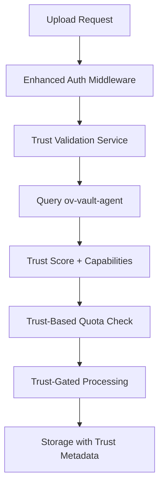

# ov-content-manager Development Roadmap

**Document Created:** Tuesday, September 23, 2025 at 9:06 PM UTC  
**Repository:** ov-content-manager (C2PA Content Processing & Storage)  
**Focus:** Trust-based storage integration and content processing enhancement

## 🎯 **Repository Mission**

Transform ov-content-manager from **flat user storage** to **trust-based storage privileges** that reward higher trust levels with better storage capabilities, quotas, and features.

## 📊 **Current State Assessment**

### **✅ What's Working (80% Complete):**
- Robust C2PA content processing and manifest generation
- MinIO/S3 storage infrastructure with bucket management
- Anonymous upload system with IP-based rate limiting
- User authentication integration with basic quotas
- Comprehensive file processing pipeline

### **❌ Critical Integration Gaps (20% Missing):**
- **NO trust level integration** - All authenticated users treated equally
- **NO ov-vault-agent connection** - Operates in complete isolation
- **NO trust-based storage privileges** - Flat quota system regardless of trust
- **NO progressive storage features** - Same capabilities for all users

## 🚀 **5-Week Development Plan**

### **WEEK 1-4: Focus on ov-vault-agent Foundation**
**Status:** ⏸️ **Wait for vault-agent completion**
**Reason:** Content manager depends on ov-vault-agent trust infrastructure

During this period:
- ✅ **Monitor ov-vault-agent progress** 
- ✅ **Plan integration architecture**
- ✅ **Prepare for trust integration**
- ✅ **Continue existing roadmap items** (hash fixes, C2PA improvements)

---

### **WEEK 5: Trust Integration Implementation** ⭐ **STORAGE PRIVILEGES**
**Goal:** Connect content manager to ov-vault-agent trust scores
**Files Modified:** `auth.ts`, `bucketService.ts`, **NEW:** `trustValidationService.ts`

#### **Day 1-2: Trust Validation Service**
```typescript
// File: src/app/services/trustValidationService.ts (NEW)
// PURPOSE: Query ov-vault-agent for user trust scores

export interface TrustValidationResult {
  trustScore: number;
  assuranceLevel: string;
  capabilities: string[];
  storagePrivileges: {
    tier: 'basic' | 'enhanced' | 'premium' | 'verified';
    quotaGB: number;
    retentionDays: number;
    features: string[];
  };
}

export class TrustValidationService {
  private vaultAgentUrl = process.env.VAULT_AGENT_URL || 'https://agent.create.originvault.me';
  private cache = new Map<string, {score: number, expiresAt: number}>();

  async getUserTrustScore(userId: string, authToken: string): Promise<TrustValidationResult> {
    // Check cache first (5-minute TTL)
    const cached = this.cache.get(userId);
    if (cached && cached.expiresAt > Date.now()) {
      return this.calculateStoragePrivileges(cached.score);
    }

    try {
      // Query ov-vault-agent for current trust score
      const response = await fetch(`${this.vaultAgentUrl}/trust-level/current`, {
        headers: {
          'Authorization': `Bearer ${authToken}`,
          'Content-Type': 'application/json'
        }
      });

      if (!response.ok) {
        throw new Error(`Failed to get trust score: ${response.statusText}`);
      }

      const trustData = await response.json();
      const trustScore = trustData.data.numericScore || 0;

      // Cache the result
      this.cache.set(userId, {
        score: trustScore,
        expiresAt: Date.now() + (5 * 60 * 1000) // 5 minutes
      });

      return this.calculateStoragePrivileges(trustScore);

    } catch (error) {
      console.error('Error validating trust score:', error);
      // Fallback to basic privileges on error
      return this.calculateStoragePrivileges(0);
    }
  }

  private calculateStoragePrivileges(trustScore: number): TrustValidationResult {
    // Trust-based storage tier calculation
    if (trustScore >= 80) {
      return {
        trustScore,
        assuranceLevel: 'verified',
        capabilities: ['advanced_c2pa', 'premium_processing', 'priority_support'],
        storagePrivileges: {
          tier: 'verified',
          quotaGB: 500,           // 500GB for verified users
          retentionDays: 0,       // Permanent retention
          features: [
            'unlimited_file_size',
            'advanced_c2pa_signing',
            'priority_processing',
            'premium_cdn',
            'analytics_access'
          ]
        }
      };
    } else if (trustScore >= 60) {
      return {
        trustScore,
        assuranceLevel: 'premium',
        capabilities: ['enhanced_c2pa', 'extended_storage'],
        storagePrivileges: {
          tier: 'premium',
          quotaGB: 100,           // 100GB for account users
          retentionDays: 365,     // 1 year retention
          features: [
            'large_file_support',
            'enhanced_c2pa',
            'extended_retention',
            'backup_storage'
          ]
        }
      };
    } else if (trustScore >= 30) {
      return {
        trustScore,
        assuranceLevel: 'enhanced',
        capabilities: ['device_sync', 'extended_quota'],
        storagePrivileges: {
          tier: 'enhanced',
          quotaGB: 25,            // 25GB for device-bound users
          retentionDays: 90,      // 90 day retention
          features: [
            'device_synchronization',
            'extended_quota',
            'basic_c2pa'
          ]
        }
      };
    } else {
      return {
        trustScore,
        assuranceLevel: 'basic',
        capabilities: ['basic_upload'],
        storagePrivileges: {
          tier: 'basic',
          quotaGB: 5,             // 5GB for basic users
          retentionDays: 30,      // 30 day retention
          features: [
            'basic_upload',
            'basic_processing'
          ]
        }
      };
    }
  }
}
```

#### **Day 3: Enhanced Authentication Middleware**
```typescript
// File: src/app/auth.ts (lines 12-37)
// ENHANCEMENT: Add trust level checking to existing auth

export async function requireAuth(req: Request, res: Response, next: NextFunction): Promise<void> {
  // ✅ KEEP: Existing JWT validation logic
  const validatedToken = await validateBearerToken(req.headers.authorization || '');
  req.auth = validatedToken.payload;
  
  // 🆕 ADD: Trust level validation
  const trustValidationService = new TrustValidationService();
  const trustResult = await trustValidationService.getUserTrustScore(
    req.auth.sub!,
    req.headers.authorization!.replace('Bearer ', '')
  );
  
  // 🆕 ADD: Attach trust context to request
  (req as any).trustContext = trustResult;
  
  next();
}

// 🆕 NEW: Trust level middleware factory
export function requireTrustLevel(minScore: number) {
  return (req: Request, res: Response, next: NextFunction) => {
    const trustContext = (req as any).trustContext;
    
    if (!trustContext || trustContext.trustScore < minScore) {
      return res.status(403).json({
        error: 'Insufficient trust level',
        required: minScore,
        current: trustContext?.trustScore || 0,
        upgradeInfo: {
          message: 'Increase your trust level in OriginVault to access this feature',
          upgradeUrl: 'https://app.originvault.me/trust-level'
        }
      });
    }
    
    next();
  };
}
```

#### **Day 4-5: Trust-Based Storage Enhancement**
```typescript
// File: src/app/services/bucketService.ts (lines 133-175)
// ENHANCEMENT: Replace flat quotas with trust-based quotas

async checkUploadQuota(userId: string, storageDid: string, fileSize: number): Promise<QuotaCheckResult> {
  // 🆕 ADD: Get user trust context (attached by auth middleware)
  const trustContext = (req as any).trustContext; // Set by enhanced auth middleware
  
  if (!trustContext) {
    // Fallback to basic quota for legacy requests
    return this.checkBasicQuota(userId, storageDid, fileSize);
  }
  
  // 🆕 NEW: Trust-based quota calculation
  const storagePrivileges = trustContext.storagePrivileges;
  const maxQuotaBytes = storagePrivileges.quotaGB * 1024 * 1024 * 1024;
  
  // ✅ REUSE: Existing usage calculation
  const currentUsage = await this.getCurrentUsage(storageDid);
  
  // 🆕 ADD: Trust-based quota enforcement
  if (currentUsage + fileSize > maxQuotaBytes) {
    return {
      allowed: false,
      currentUsage,
      maxQuota: maxQuotaBytes,
      usagePercentage: (currentUsage / maxQuotaBytes) * 100,
      remainingQuota: maxQuotaBytes - currentUsage,
      error: `Trust level ${trustContext.assuranceLevel} allows ${storagePrivileges.quotaGB}GB quota. Upgrade trust level for more storage.`
    };
  }

  return {
    allowed: true,
    currentUsage,
    maxQuota: maxQuotaBytes,
    usagePercentage: (currentUsage / maxQuotaBytes) * 100,
    remainingQuota: maxQuotaBytes - currentUsage
  };
}
```

### **Trust-Based Feature Gating:**
```typescript
// File: src/app/routes/files.ts (add trust level gates)
// ENHANCEMENT: Add trust requirements to existing endpoints

// Basic upload - no trust requirement (keep existing)
router.post('/upload', requireAuth, async (req, res) => {
  // ✅ EXISTING: Works for all authenticated users
});

// Advanced processing - requires enhanced trust
router.post('/process-advanced', requireAuth, requireTrustLevel(60), async (req, res) => {
  // 🆕 NEW: Advanced C2PA features for account+ users
  const trustContext = (req as any).trustContext;
  const features = trustContext.storagePrivileges.features;
  
  if (features.includes('enhanced_c2pa')) {
    // Process with advanced C2PA features
    await this.c2paService.generateAdvancedManifest(req.file);
  }
});

// Premium features - requires verified trust
router.post('/premium-processing', requireAuth, requireTrustLevel(80), async (req, res) => {
  // 🆕 NEW: Premium features for verified users only
  const trustContext = (req as any).trustContext;
  
  if (trustContext.storagePrivileges.features.includes('premium_cdn')) {
    // Enable premium CDN features
    await this.cdnService.enablePremiumDelivery(req.file);
  }
});
```

**Week 5 Deliverables:**
- ✅ Trust score validation service
- ✅ Trust-based storage quotas (5GB → 500GB progression)
- ✅ Trust-gated content processing features
- ✅ Premium features for verified users
- ✅ Real-time trust level enforcement

---

## 🔧 **Repository-Specific Architecture**

### **Current C2PA Integration (Keep):**
```
c2paService.ts (✅ Production Ready)
├── Manifest generation for all file types
├── Content signing and verification  
├── Metadata extraction and processing
└── 🆕 ADD: Trust-based C2PA feature levels
```

### **Enhanced Storage Architecture:**
```
Trust-Integrated Storage Pipeline:
├── auth.ts (Enhanced with trust validation)
├── trustValidationService.ts (NEW - Query vault-agent)
├── bucketService.ts (Enhanced with trust-based quotas)
├── storageService.ts (Enhanced with trust-based features)
└── Trust-gated processing features
```

### **Integration Flow:**


## 📈 **Success Metrics for ov-content-manager**

### **Integration Metrics:**
- ✅ **Real-time trust validation** from ov-vault-agent
- ✅ **Trust-based quota enforcement** (5GB → 500GB)
- ✅ **Progressive feature unlocking** based on trust level
- ✅ **Storage tier differentiation** visible to users

### **User Experience Metrics:**
- ✅ **Clear storage progression** (trust level = storage benefits)
- ✅ **Premium features for verified users** (advanced C2PA, CDN)
- ✅ **Automatic quota increases** on trust level up
- ✅ **Trust-gated processing** (basic → enhanced → premium)

## 🎪 **Repository Dependencies**

### **Depends on ov-vault-agent:**
- **Week 5 implementation** requires completed vault-agent trust infrastructure
- **Trust score API** must be stable and performant
- **Authentication token validation** for cross-service communication

### **Provides to ecosystem:**
- **Trust-based storage** rewards for higher trust users
- **Progressive content features** (basic → premium C2PA)
- **Storage tier visualization** for user trust progression

**Implementation Timeline:** Week 5 of overall roadmap (after vault-agent foundation complete)
