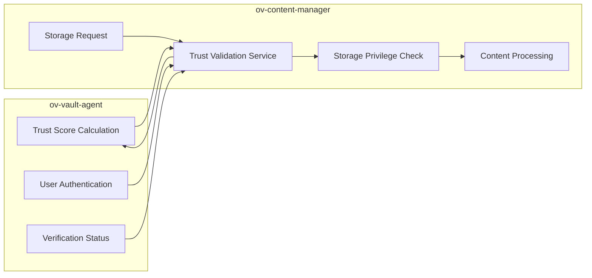

# Trust Levels Integration - ov-content-manager

**Document Created:** Tuesday, September 23, 2025 at 8:47 PM UTC  
**Repository:** ov-content-manager (C2PA Content Processing & Storage)  
**Purpose:** Trust-Based Storage Access Implementation Guide

## 🏗️ **Repository Role in Trust Ecosystem**

The `ov-content-manager` serves as the **content processing and storage layer** with C2PA manifest generation. It currently operates **independently** of trust levels but should be **integrated** for trust-based storage privileges.

**Current Architecture:**
- **C2PA Service:** Content authenticity manifest generation
- **MinIO/S3 Storage:** File storage with bucket management
- **Anonymous Access:** IP-based rate limiting and quotas
- **User Storage:** Basic authenticated user storage

## 📊 **Trust Level Integration Points**

### **Level 0-15: Anonymous Testnet Content Processing**
**Current Implementation:** ✅ **Fully Implemented**

**Existing Services:**
- ✅ `src/app/routes/anonymous.ts` - Anonymous upload endpoints
- ✅ `src/app/services/c2paService.ts` - C2PA manifest generation
- ✅ `src/app/middleware/redisRateLimit.ts` - IP-based rate limiting
- ✅ Anonymous bucket management

**Current Features:**
```typescript
// Anonymous user capabilities (IP-based, testnet learning)
- Upload files up to 10MB
- Generate C2PA manifests for testnet learning
- 24-hour file retention (practice environment)
- IP-based rate limiting (10 uploads/hour)
- Basic duplicate detection
```

**Testnet Learning Integration:**
- **Anonymous Content Storage:** Files stored with testnet learning context
- **C2PA Education:** Users see how content authenticity works
- **Risk-Free Experimentation:** No permanent storage, safe to experiment
- **Progression Messaging:** "Bind device to unlock mainnet storage"

**Trust Integration Needed:**
- **Connect to ov-vault-agent:** Validate PoP credentials from vault-agent
- **Testnet-Aware Quotas:** Anonymous users with PoP get higher limits
- **Learning-Based Retention:** Show temporary nature vs permanent mainnet storage

---

### **Level 15-45: Device-Bound Mainnet Storage**  
**Current Implementation:** ⚠️ **Partially Implemented**

**Existing Services:**
- ✅ Basic authenticated user storage
- ✅ User-specific bucket creation
- ✅ `src/app/services/bucketService.ts` - Quota management
- ⚠️ **NO trust level integration**

**Current Features:**
```typescript
// Device-bound user capabilities (mainnet credentials)
- Upload files up to 100MB
- Persistent storage buckets  
- User-specific folders
- Basic quota management
```

**Mainnet Storage Benefits (Needed):**
```typescript
// MISSING: Mainnet credential storage privileges
Level 15: Local user      → 1GB quota, testnet-linked storage
Level 30: Device-bound    → 5GB quota, mainnet-backed security
Level 45: Secure device   → 15GB quota, premium processing
```

**Trust Integration Needed:**
- **Mainnet Credential Validation:** Verify users have mainnet server DID credentials
- **Enhanced Security:** Device-bound users get better storage security
- **Premium Processing:** Hardware-attested users get advanced C2PA features

---

### **Level 45-60: Personal Testnet DID Storage**
**Current Implementation:** ⚠️ **Basic Implementation**

**Existing Services:**
- ✅ User DID-based storage buckets
- ✅ `src/app/services/didManager.ts` - DID-linked storage
- ✅ Storage DID creation and management
- ⚠️ **NO trust level differentiation**

**Current Features:**
```typescript
// Account user capabilities (personal testnet DID)
- Unlimited file size (within reason)
- Persistent DID-linked buckets
- Content metadata tracking
```

**Personal Testnet DID Storage Benefits (Needed):**
```typescript
// MISSING: Personal DID storage privileges
Level 45: Personal testnet DID    → 25GB quota, learning environment
Level 50: DID management exp      → 40GB quota, advanced features
Level 55: Credential issuance     → 60GB quota, community features  
Level 60: Ready for verification  → 75GB quota, pre-mainnet status
```

**Trust Integration Needed:**
- **Personal DID Validation:** Verify users have personal testnet DIDs
- **Learning Progress:** Storage privileges tied to testnet mastery
- **Mainnet Readiness:** Storage benefits prepare for verification

---

### **Level 60-80: Verified User & Mainnet Graduation Storage**
**Current Implementation:** ❌ **Not Implemented**

**Missing Services:**
- ❌ **NO verified user storage tier**
- ❌ **NO KYC-based storage privileges**  
- ❌ **NO mainnet graduation storage benefits**

**Should Have:**
```typescript
// MISSING: Verified user storage progression
Level 60: KYC initiated       → 100GB quota, verification prep
Level 70: KYC verified        → 250GB quota, mainnet ready
Level 80: Mainnet eligible    → 400GB quota, graduation prep
Level 85: Mainnet graduated   → 500GB quota, permanent status
```

**Mainnet Graduation Storage Benefits:**
- **Permanent Storage:** Mainnet users get permanent file retention
- **Premium C2PA:** Advanced content authenticity features
- **Priority Processing:** Faster upload and processing queues
- **Governance Storage:** Community content moderation tools

**Integration Points:**
- **KYC Status:** Query ov-vault-agent for verification status
- **Mainnet Status:** Check for personal mainnet DID ownership
- **Trust Score:** Real-time trust level checking for storage privileges
- **Graduation Gates:** Mainnet features locked behind graduation

---

### **Level 80+: Mainnet Community Storage Features**
**Current Implementation:** ❌ **Not Implemented**

**Missing Integration:**
- ❌ **NO mainnet community storage features**
- ❌ **NO endorsement-based storage bonuses**
- ❌ **NO community governance storage tools**

**Should Have:**
```typescript
// MISSING: Mainnet community storage features
Level 85:  Mainnet graduated    → 500GB permanent storage
Level 90:  Community member     → 750GB + shared storage pools
Level 95:  Community leader     → 1TB + content moderation tools
Level 100: Platform endorser    → 2TB + advanced governance features
```

**Mainnet Community Storage Benefits:**
- **Permanent Retention:** No expiry for mainnet community members
- **Shared Storage Pools:** Community content collaboration
- **Advanced C2PA:** Community content signing and verification
- **Moderation Tools:** Community-governed content management

## 🔧 **Current Service Architecture**

### **C2PA Integration Status:**
```
c2paService.ts (✅ Complete)
├── Manifest generation (✅)
├── Content signing (✅)
├── Metadata extraction (✅)
└── Trust integration (❌ Missing)

bucketService.ts (⚠️ Basic)
├── Quota management (✅)
├── User bucket creation (✅)
└── Trust-based quotas (❌ Missing)

storageService.ts (⚠️ Basic)
├── DID-linked storage (✅)
├── Storage assertions (✅)
└── Trust-based storage tiers (❌ Missing)
```

## 🎯 **Required Authentication Integration**

### **Current Authentication:**
```typescript
// Basic OIDC validation in auth.ts
export async function requireAuth(req: Request, res: Response, next: NextFunction) {
  // ✅ Validates Logto JWT tokens
  // ❌ NO trust level checking
  // ❌ NO vault-agent integration
}
```

### **Needed Enhancement:**
```typescript
// MISSING: Trust-aware authentication
export async function requireTrustLevel(minLevel: number) {
  return async (req: Request, res: Response, next: NextFunction) => {
    // 1. Validate JWT (existing)
    // 2. Query ov-vault-agent for trust score (NEW)
    // 3. Check if user meets minimum level (NEW)
    // 4. Grant/deny access based on trust (NEW)
  };
}
```

## 🌉 **Integration Architecture Needed**

### **Trust Score Validation Service:**
```typescript
// NEW: src/app/services/trustValidationService.ts
export class TrustValidationService {
  async getUserTrustScore(userId: string): Promise<number> {
    // Query ov-vault-agent for current trust score
    const response = await fetch(`${VAULT_AGENT_URL}/trust-level/current`, {
      headers: { 'Authorization': `Bearer ${userToken}` }
    });
    return response.data.numericScore;
  }
  
  async checkStoragePrivileges(userId: string): Promise<StoragePrivileges> {
    const trustScore = await this.getUserTrustScore(userId);
    return this.calculateStoragePrivileges(trustScore);
  }
}
```

## 📁 **File-Level Integration Points**

### **Files Needing Trust Integration:**
1. **`src/app/routes/storage.ts`** - Add trust level checks
2. **`src/app/routes/files.ts`** - Trust-based upload limits  
3. **`src/app/services/bucketService.ts`** - Trust-based quotas
4. **`src/app/auth.ts`** - Trust-aware authentication
5. **`src/app/routes/bucketManagement.ts`** - Trust-based bucket features

### **New Files Needed:**
1. **`src/app/services/trustValidationService.ts`** - Query vault-agent for trust
2. **`src/app/middleware/trustLevelMiddleware.ts`** - Trust-based request gating
3. **`src/app/config/trustLevels.ts`** - Trust level → storage privilege mapping

## 🔄 **Integration Flow Diagram**



**Bottom Line:** Content manager has **excellent infrastructure** but **zero trust integration**. It's treating all authenticated users the same, missing the entire trust progression value proposition.

**Next:** ov-public-utility-tool analysis...
